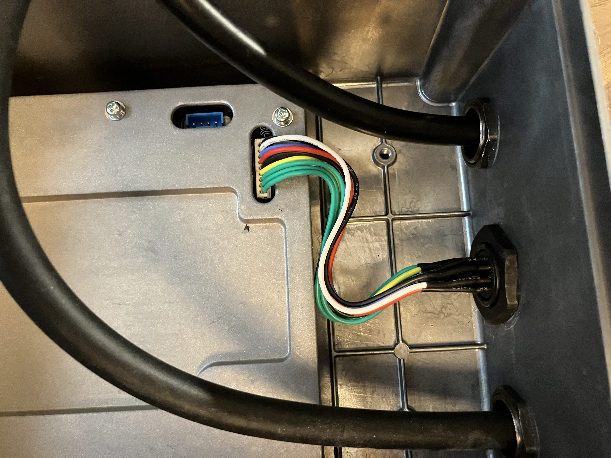

# isaver-RS485-modbus-
NVERSilence, Madimack, Rapid X20, AtecPool, Trendpool, Vario, AquaForte, Vitalia, Aquagripp, Aquagem iSaver pool inverter

### further links:
https://community.home-assistant.io/t/modbus-isaver-pool-pump-inverter-custom-commands-issue-response-mising-bytes/714637
https://github.com/htilly/ha-esp32-variable-speed-drive-esphome

## Wiring :
- JST-PH-9 (2mm) --> https://www.amazon.de/dp/B0BM82KR17?ref=ppx_yo2ov_dt_b_fed_asin_title
- SP21 9pin IP68 --> https://www.amazon.de/dp/B07GZPTZJV?ref=ppx_yo2ov_dt_b_fed_asin_title&th=1
- you need to widen the hole 20mm -> 21mm   

|----bl---wh---bl---re---bl---ye---gr---gr---gr---     
|----1----2----3----4----5----6----7----8----9---  
|-GND-V/I----B---A---GND--IN1-IN2-IN3-IN4--    
|--analog---|-RS485-|---digital------------------|

## 1.) Analog Input
- not tested

## 2.) RS485 
-> this is not standard modbus rtu!!!
-> so it won#t work with standard implementations
-> check protocol.pdf: 1200-8-N-1; default slave 0xAA(170)

### precondition:
- power on inverter manually - motor running!
- now you can change rpm or turn off/on by RS485
- if power off manually (keyboard), you can't wakeup inverter by rs485
- if power off/on by powerloss, you can control the inverter by rs485 IF the inverter was running or was shutdown by RS485 when it lost power
- after wake up by commanded rpm, inverter is using max rpm for 60sec
- NOTE: after commanding rpm, override is active for just 60sec, afterwards inverter switching to last known manuall state
- NOTE: you have to poll(read) information with 0xC3 frequently (<60sec) to keep the commanded rpm active (not sure if extensive writing with 0xD0 will kill eeprom)
- NOTE: RS485 has a lower priority then digital input
- NOTE: RS485 turn off timer programm -> 

### examples:
READ -> 0xC3 Command not 0x03 like standard modbus    
AA C3 07 D1 00 00 0D 4D    
RESPONSE   
AA C3 00 00 01 05 46 D3 5B   

WRITE 2000rpm -> D0 Command   
AA D0 0B B9 07 D0 09 AE   
RESPONSE   
AA D0 0B B9 00 02 00 83 67   

WRITE off (1rpm)   
AA D0 0B B9 00 01 CB C2   
RESPONSE   
AA D0 0B B9 00 02 00 83 67   
 
## 3.) Digital Input
-> permanently connecting IN1-4 to ground will activate the function
- GND: ground
- IN1: Off - this really power off inverter! you can't wake with rs485, just IN2-4, but will never be
- IN2: ON 2900rpm (backwash) - if disconnected, the control priority will be back on panel control;
- IN3: ON 2400rpm (day mode) - if disconnected, the control priority will be back on panel control;
- IN4: ON 1200rpm (night mode) - if disconnected, the control priority will be back on panel control;

## usage:
 For example
 - inverter is on night mode
 - connecting IN2 to GND will force 2900rpm... if disconnected, inverter switch back to previous state (night mode)

 - inverter is off
 - connecting IN2 to GND will force 2900rpm... if disconnected, inverter switch back to off
